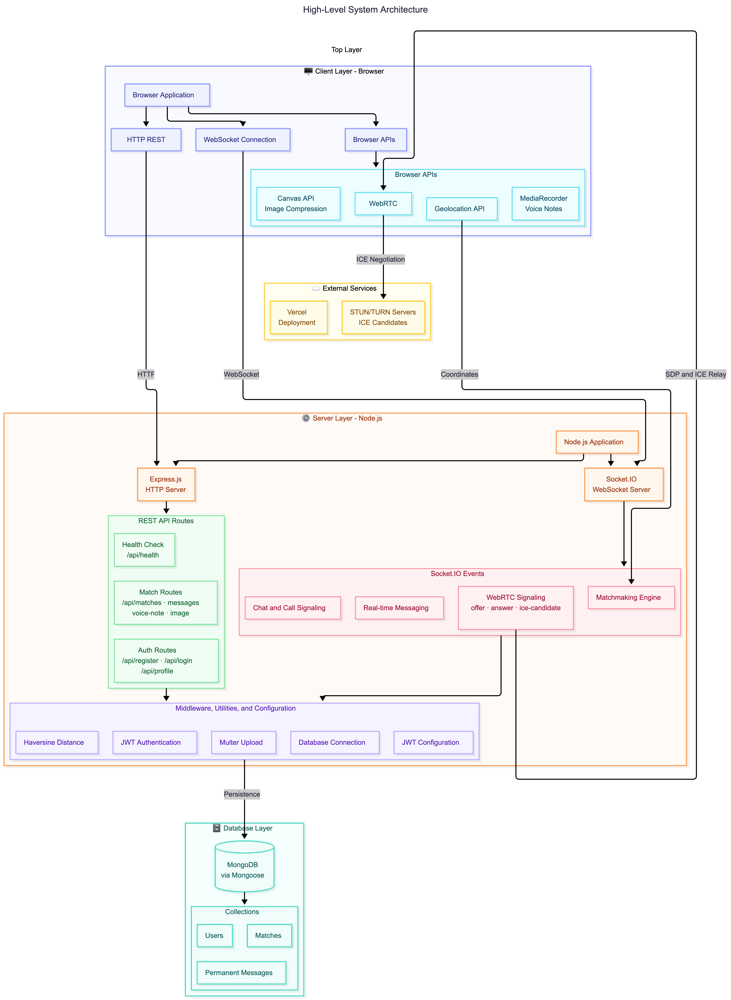

# SparkMatch

> Real-Time Geolocated Stranger Matching & WebRTC Video Calling Platform

[](https://nodejs.org/)
[](https://expressjs.com/)
[](https://socket.io/)
[](https://webrtc.org/)
[](https://www.mongodb.com/)
[](LICENSE)

SparkMatch is a real-time web application that connects nearby users for spontaneous peer-to-peer video calls using geographic location data and low-latency WebRTC streaming.

---

## 3. Description

**SparkMatch** solves the problem of generic, distant stranger-matching by prioritizing physical proximity. By leveraging the browser's Geolocation API and calculating spatial distances using the **Haversine formula**, SparkMatch connects users who are geographically closest to each other first.

During a random video match, users can anonymously "like" their conversation partner. If both users mutually like each other, the app permanently saves the match to MongoDB and unlocks a persistent chat room. Unlocked connections can communicate anytime through text, shared photos, voice notes, and direct 1-on-1 audio/video calls.

---

## 4. Table of Contents

- [Features](#5-features)
- [System Architecture](#6-system-architecture)
- [Installation & Setup](#7-installation)
- [Usage & App Workflow](#8-usage)
- [Configuration](#9-configuration)
- [Testing & Health Check](#10-testing)
- [Project Structure](#11-project-structure)
- [Roadmap](#12-roadmap)
- [Contributing](#13-contributing)
- [License](#14-license)
- [Contact / Support](#16-contact--support)

---

## 5. Features

- **Geolocated Matchmaking**: Calculates spatial distance between waiting users using the Haversine distance formula to prioritize matches within the closest physical radius.
- **Low-Latency WebRTC Video & Audio**: Direct peer-to-peer media streaming negotiated via Socket.IO signaling servers and ICE/STUN candidates.
- **Mutual-Like System**: Anonymous during-call liking mechanism. When both users express mutual interest, a permanent connection is automatically saved to the database.
- **Persistent Chat**: Unlocked matches gain access to a dedicated chat room featuring real-time messaging, client-compressed photo uploads, and embedded audio voice notes.
- **Direct 1-on-1 Re-Calling**: Re-initiate intentional video or audio calls with permanent connections directly from the chat interface, featuring split-screen and picture-in-picture view modes.
- **Secure Authentication**: User sign-up and sign-in protected by `bcryptjs` password hashing (10 salt rounds) and 7-day stateless JSON Web Tokens (JWT).
- **Client-Side Media Compression**: Automatic image compression via HTML5 Canvas API before base64 encoding to optimize memory usage and database storage.

---

## 6. System Architecture

SparkMatch is built on an event-driven architecture powered by Express.js, Socket.IO, and WebRTC. Below are previews of the system's core architecture and matchmaking pipeline.

### High-Level System Architecture


### Matchmaking & WebRTC Video Call Flow


> 📘 **Full Architecture Documentation**: Explore all 10 system architecture diagrams (including Data Models, Auth Pipeline, Socket Event Maps, and State Management) in [docs/ARCHITECTURE.md](docs/ARCHITECTURE.md).

---

## 7. Installation

Follow these steps to set up and run SparkMatch locally on your machine.

### Prerequisites

- [Node.js](https://nodejs.org/) (v18.x or higher)
- [npm](https://www.npmjs.com/) (v9.x or higher)
- A running [MongoDB](https://www.mongodb.com/) instance (local or MongoDB Atlas connection URI)

### Step-by-Step Setup

1. **Clone the repository:**
   ```bash
   git clone https://github.com/shortcut-jawad/SparkMatch.git
   cd SparkMatch
   ```

2. **Install project dependencies:**
   ```bash
   npm install
   ```

3. **Configure Environment Variables:**
   Create a `.env` file in the root directory:
   ```env
   PORT=3000
   MONGO_URI=mongodb+srv://<username>:<password>@cluster.mongodb.net/sparkmatch?retryWrites=true&w=wide
   JWT_SECRET=your_super_secret_jwt_key_here
   ```

4. **Start the application:**
   ```bash
   npm start
   ```

5. **Access the application:**
   Open your browser and navigate to `http://localhost:3000`.

---

## 8. Usage

### Application Workflow

1. **Sign Up & Profile Setup**: Create an account with a unique username, password, display name, bio, city, and profile picture.
2. **Start Matching**: Click **Start Matching** from the main dashboard to enter the real-time queue.
3. **Allow Geolocation**: When prompted, allow browser location access so the app can match you with the closest available user using latitude and longitude coordinates. If declined, the server will match you randomly from the general pool.
4. **Video Call & Match Handshake**: When another online user is found, accept the match request to begin an instant WebRTC video call.
5. **Mutual Liking**: Click the **Like** button in the upper-right corner during the video call. If both users click like, a permanent match is created.
6. **Persistent Chat & Direct Re-Calling**: Open your saved matches in the sidebar to exchange text messages, send voice notes, share images, or initiate direct audio/video calls anytime.

---

## 9. Configuration

The server relies on the following environment variables:

| Variable | Type | Default | Description |
|----------|------|---------|-------------|
| `PORT` | Number | `3000` | Port number for the Express and Socket.IO server |
| `MONGO_URI` | String | *Required* | MongoDB connection URI string |
| `JWT_SECRET` | String | `sparkmatch_jwt_secret_2024` | Secret key used to sign and verify JWT authentication tokens |

---

## 10. Testing

You can test the server health and database connectivity by querying the health endpoint:

```bash
curl http://localhost:3000/api/health
```

**Expected Response:**
```json
{
  "ok": true
}
```

---

## 11. Project Structure

```
SparkMatch/
├── config/
│   ├── db.js                 # MongoDB connection logic (Mongoose pool)
│   └── jwt.js                # JWT secret configuration
├── docs/
│   ├── ARCHITECTURE.md       # Detailed technical architecture document
│   └── images/               # System architecture diagrams (Diagrams 1-10)
├── middleware/
│   ├── auth.js               # JWT bearer token verification middleware
│   └── upload.js             # Multer in-memory upload filter (images & audio)
├── models/
│   ├── User.js               # User schema (credentials, profile data)
│   ├── Match.js              # Match schema (paired user IDs)
│   └── PermanentMessage.js   # Message schema (text, voice, photo data)
├── public/
│   ├── css/                  # Styling (auth.css, app.css, chat-media.css)
│   ├── js/                   # Vanilla ES modules (webrtc.js, matchmaking.js, etc.)
│   ├── index.html            # Landing / Login page
│   ├── signup.html           # Registration page
│   └── app.html              # Main video match & chat dashboard
├── routes/
│   ├── authRoutes.js         # Authentication endpoints (/register, /login, /profile)
│   └── matchRoutes.js        # Match & messaging endpoints (/matches, /messages)
├── sockets/
│   └── socketHandler.js      # Socket.IO matchmaking queue & WebRTC signaling
├── utils/
│   ├── geo.js                # Haversine distance formula algorithm
│   └── helpers.js            # User object sanitizer
├── package.json
├── server.js                 # Application entry point
└── vercel.json               # Deployment configuration
```

---

## 12. Roadmap

- [ ] **STUN/TURN Relay Server Integration**: Add custom TURN configuration (e.g. Coturn / Twilio Network) for restricted NAT environments.
- [ ] **End-to-End Encryption**: Encrypt persistent chat text messages and voice notes prior to database storage.
- [ ] **Notification Badges**: Push notifications for incoming direct call invitations when the app is minimized.
- [ ] **Group Video Rooms**: Interest-based multi-user video calling rooms.

---

## 13. Contributing

Contributions are welcome! Please follow these steps:

1. Fork the repository (`https://github.com/shortcut-jawad/SparkMatch/fork`).
2. Create your feature branch (`git checkout -b feature/AmazingFeature`).
3. Commit your changes (`git commit -m 'Add some AmazingFeature'`).
4. Push to the branch (`git push origin feature/AmazingFeature`).
5. Open a Pull Request.

---

## 14. License

This project is licensed under the **ISC License**.

---

## 16. Contact / Support

- **Repository**: [https://github.com/shortcut-jawad/SparkMatch](https://github.com/shortcut-jawad/SparkMatch)
- **Live Demo**: [https://sparkmatch-production-eada.up.railway.app](https://sparkmatch-production-eada.up.railway.app)
- **Issue Tracker**: [https://github.com/shortcut-jawad/SparkMatch/issues](https://github.com/shortcut-jawad/SparkMatch/issues)
