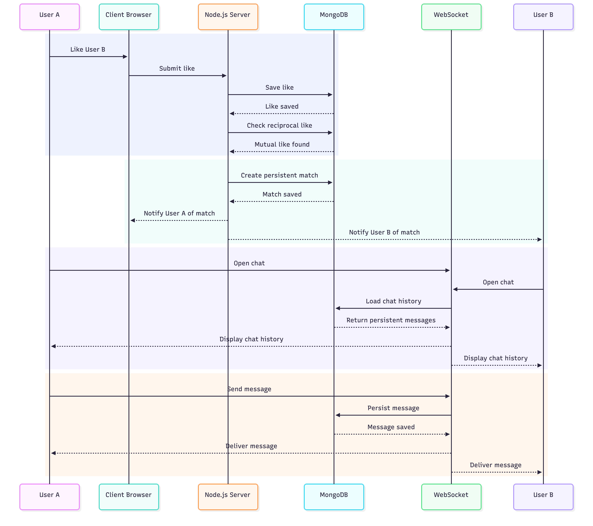
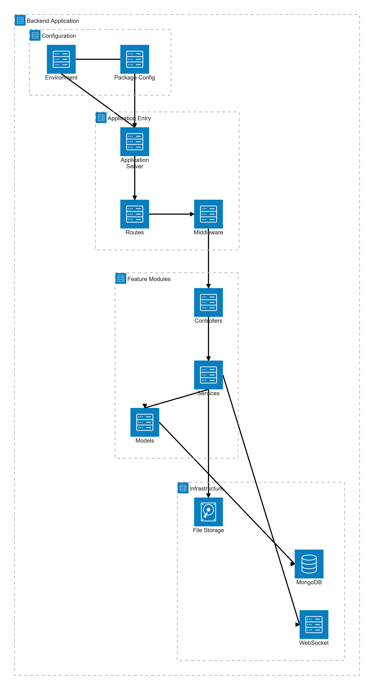
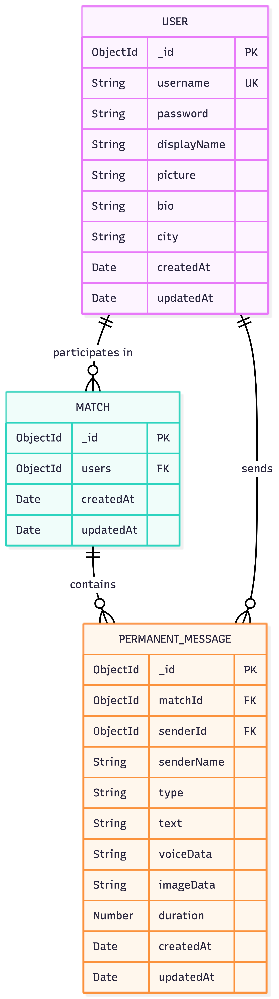
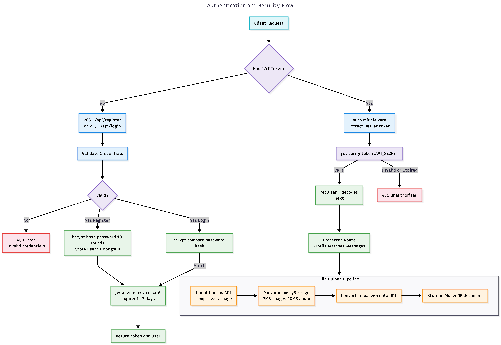
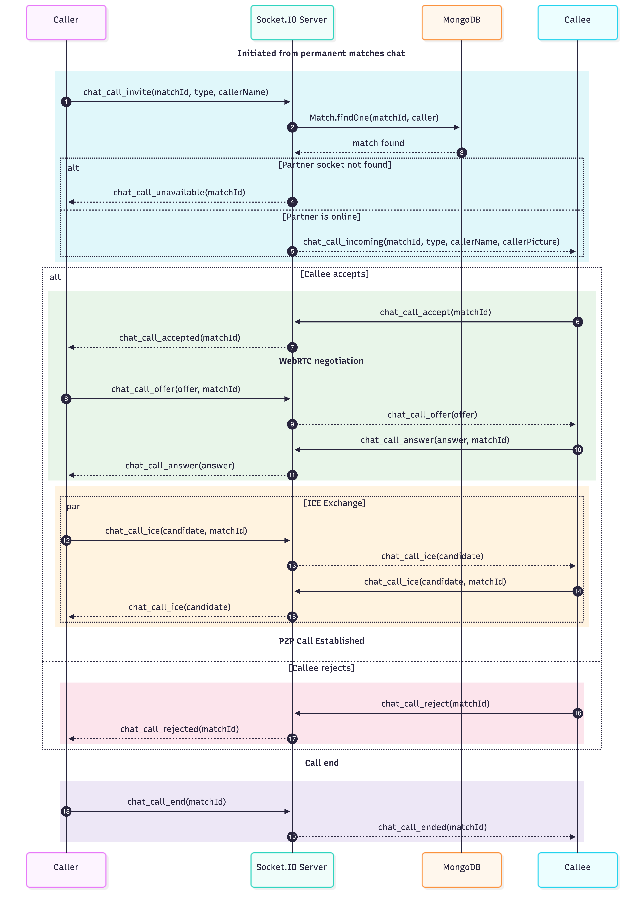
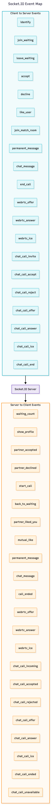
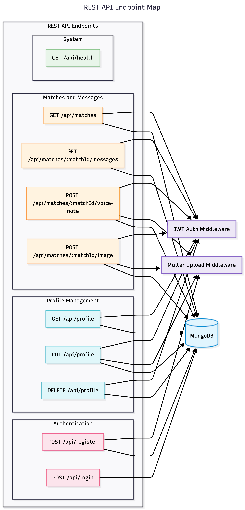
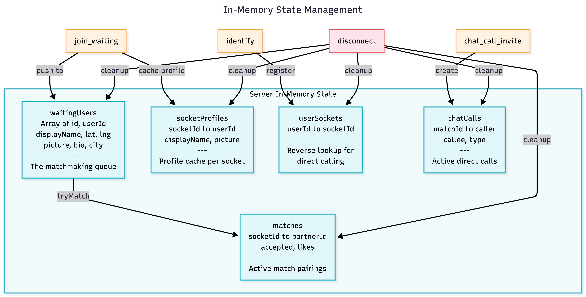

# SparkMatch — System Architecture Documentation

This document provides a comprehensive technical breakdown of **SparkMatch**, a real-time geolocated stranger-matching platform featuring WebRTC peer-to-peer video calls, mutual-like persistence, and direct chat/re-calling capabilities.

---

## Table of Contents

1. [Diagram 1: High-Level System Architecture](#1-diagram-1-high-level-system-architecture)
2. [Diagram 2: Matchmaking & Video Call Flow](#2-diagram-2-matchmaking--video-call-flow)
3. [Diagram 3: Mutual Like → Persistent Chat Flow](#3-diagram-3-mutual-like--persistent-chat-flow)
4. [Diagram 4: Backend File Architecture](#4-diagram-4-backend-file-architecture)
5. [Diagram 5: Data Model (Entity Relationship)](#5-diagram-5-data-model-entity-relationship)
6. [Diagram 6: Authentication & Security Flow](#6-diagram-6-authentication--security-flow)
7. [Diagram 7: Chat Call (Direct Re-Calling) Flow](#7-diagram-7-chat-call-direct-re-calling-flow)
8. [Diagram 8: Socket.IO Event Map](#8-diagram-8-socketio-event-map)
9. [Diagram 9: REST API Endpoint Map](#9-diagram-9-rest-api-endpoint-map)
10. [Diagram 10: In-Memory State Management](#10-diagram-10-in-memory-state-management)

---

## 1. Diagram 1: High-Level System Architecture

The high-level architecture diagram illustrates the end-to-end interaction between the client browser, Node.js/Express server, Socket.IO WebSocket signaling service, MongoDB database, and external ICE/STUN infrastructure.

### Key Architectural Layers:
- **Client Layer (Vanilla JS & Browser APIs)**: Handles HTML5 Media Capture, Geolocation API for coordinate retrieval, WebRTC API for peer-to-peer video/audio streaming, and Canvas API for client-side image compression.
- **Server Layer (Node.js & Express & Socket.IO)**: Houses RESTful API routes for authentication and profile management, Socket.IO server for matchmaking and real-time signaling, and custom middleware for JWT validation and Multer file parsing.
- **Database Layer (MongoDB & Mongoose)**: Persists user accounts, permanent match associations, and chat history.
- **External Services**: Integrates public STUN/TURN servers for WebRTC ICE candidate gathering and Vercel hosting.

---

## 2. Diagram 2: Matchmaking & Video Call Flow

This sequence diagram depicts how two nearby users enter the Socket.IO waiting queue, get matched using the Haversine distance algorithm, accept the match, and negotiate a WebRTC P2P video stream.

### Flow Steps:
1. **Queue Entry**: Users join the queue by sending `join_waiting` with location coordinates.
2. **Haversine Match Selection**: The server iterates over waiting users, calculating distances via `haversineKm()` to pair the geographically closest users.
3. **Accept / Decline Step**: Profiles are exchanged (`show_profile`). Once both click "Accept", `start_call` triggers the WebRTC handshake.
4. **WebRTC Signaling**: Peer A creates an offer (`webrtc_offer`), Peer B responds with an answer (`webrtc_answer`), and ICE candidates (`webrtc_ice`) are relayed via Socket.IO until direct P2P video/audio streams are active.

---

## 3. Diagram 3: Mutual Like → Persistent Chat Flow

During a live video call, users can anonymously "like" their partner. When both users mutually like each other, the connection is saved permanently in MongoDB and a dedicated chat room is unlocked.

### Flow Steps:
1. **Anonymous Like**: User A emits `like_user`. User B receives `partner_liked_you`.
2. **Mutual Match Detection**: When User B also emits `like_user`, the server verifies the mutual match, creates a new `Match` document in MongoDB, and returns `mutual_like` with a unique `matchId`.
3. **Room Subscription**: Both clients automatically join the Socket.IO room `match_<matchId>`.
4. **Persistent Messaging**: All subsequent text, photo, or voice messages sent to this room are persisted to the `PermanentMessage` collection in MongoDB.

---

## 4. Diagram 4: Backend File Architecture

Organized modular design separating routes, sockets, middleware, data models, configuration, utilities, and client static assets.

### Directory Breakdown:
- `config/`: MongoDB connection pool (`db.js`) and JWT configuration (`jwt.js`).
- `middleware/`: Bearer token authentication (`auth.js`) and Multer memory storage upload filters (`upload.js`).
- `models/`: Mongoose schemas for `User`, `Match`, and `PermanentMessage`.
- `routes/`: Express routers for `/api` auth/profile endpoints and `/api/matches` chat history/media upload endpoints.
- `sockets/`: Complete Socket.IO event handling, queue logic, and WebRTC signaling (`socketHandler.js`).
- `utils/`: Spatial math (`geo.js`) and user object sanitizers (`helpers.js`).

---

## 5. Diagram 5: Data Model (Entity Relationship)

The database schema models users, match connections, and rich multi-media chat messages stored in MongoDB.

### Schema Overview:
- **User**: Stores login credentials (`username`, hashed `password`), profile metadata (`displayName`, `bio`, `city`), and compressed profile `picture` (base64 Data URI).
- **Match**: Links two `User` ObjectIds together upon mutual liking.
- **PermanentMessage**: References a `Match` and `User` sender, supporting `type` enum (`text`, `voice`, `image`), raw content string, base64 `voiceData` or `imageData`, and voice note `duration`.

---

## 6. Diagram 6: Authentication & Security Flow

Covers user registration, password security, JWT session validation, and media upload filtering.

### Security Features:
- **Password Hashing**: Passwords are encrypted using `bcryptjs` with 10 salt rounds before storage.
- **Stateless Authentication**: Signed JSON Web Tokens (`jwt.sign`) with 7-day expiration authorize protected API endpoints.
- **Media Upload Pipeline**: Client-side canvas compression reduces photo file size before sending base64 payloads to Multer's in-memory buffer (capped at 2MB for images, 10MB for voice notes).

---

## 7. Diagram 7: Chat Call (Direct Re-Calling) Flow

Matched users can initiate direct, 1-on-1 audio or video calls with their permanent connections directly from the chat sidebar.

### Flow Steps:
1. **Call Invite**: Caller emits `chat_call_invite` targeting a `matchId`.
2. **Availability Check**: The server looks up the partner's socket in `userSockets`. If offline, `chat_call_unavailable` is returned. If online, `chat_call_incoming` is delivered to the callee.
3. **Handshake & WebRTC**: If accepted, Socket.IO routes `chat_call_offer`, `chat_call_answer`, and `chat_call_ice` to establish a direct WebRTC stream between the two connected friends.

---

## 8. Diagram 8: Socket.IO Event Map

Complete catalog of incoming client events and outgoing server broadcasts handled by `sockets/socketHandler.js`.

### Key Event Categories:
- **Queue Events**: `identify`, `join_waiting`, `leave_waiting`, `waiting_count`.
- **Match Handshake**: `show_profile`, `accept`, `decline`, `partner_accepted`, `partner_declined`, `start_call`, `back_to_waiting`.
- **Liking & Rooms**: `like_user`, `partner_liked_you`, `mutual_like`, `join_match_room`.
- **Signaling Events**: `webrtc_offer`, `webrtc_answer`, `webrtc_ice`, `end_call`.
- **Direct Calling Events**: `chat_call_invite`, `chat_call_accept`, `chat_call_reject`, `chat_call_offer`, `chat_call_answer`, `chat_call_ice`, `chat_call_end`.

---

## 9. Diagram 9: REST API Endpoint Map

Overview of HTTP REST routes provided by Express.js.

### Endpoint Summary:
| Method | Path | Auth Required | Description |
|--------|------|---------------|-------------|
| `GET` | `/api/health` | No | Server status check |
| `POST` | `/api/register` | No | Register new account with optional picture upload |
| `POST` | `/api/login` | No | Authenticate user and return JWT token |
| `GET` | `/api/profile` | Yes | Get authenticated user profile |
| `PUT` | `/api/profile` | Yes | Update profile info, password, or picture |
| `DELETE` | `/api/profile` | Yes | Delete user account |
| `GET` | `/api/matches` | Yes | List all permanent matches with last message preview |
| `GET` | `/api/matches/:id/messages` | Yes | Fetch message history for a match |
| `POST` | `/api/matches/:id/voice-note` | Yes | Upload base64 voice note audio file |
| `POST` | `/api/matches/:id/image` | Yes | Upload base64 chat image |

---

## 10. Diagram 10: In-Memory State Management

Illustrates the server-side in-memory data structures maintained in `socketHandler.js` for zero-latency matchmaking and signaling.

### In-Memory Structures:
- `waitingUsers[]`: Array holding users currently waiting in queue with coordinates.
- `matches{}`: Key-value map tracking active pairings and temporary like states (`socketId → { partnerId, accepted, likes }`).
- `socketProfiles{}`: Map storing socket profile details (`socketId → profile`).
- `userSockets{}`: Reverse lookup index mapping `userId → socketId` for instant direct routing.
- `chatCalls{}`: Active direct call sessions (`matchId → { caller, callee, type }`).
